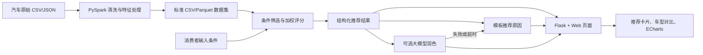

# 系统架构设计

## 1. 架构原则

- Spark 负责离线数据处理，不要求每次推荐都启动 Spark 作业；
- 在线推荐使用处理后的标准数据，保证演示响应速度；
- Flask 只提供页面和少量 JSON 接口；
- 推荐算法与大模型说明分离；
- 所有外部能力都必须有本地降级方案。

## 2. 总体架构

## 3. 模块边界

### `src/spark_jobs/`

负责读取原始数据、清洗字段、处理缺失和异常值、生成衍生特征，并输出标准 CSV 或 Parquet。不得包含页面逻辑。

### `src/recommender/`

负责请求校验、硬性筛选、权重评分、结果排序、条件放宽和模板化推荐原因。不得依赖 Flask 请求对象，便于独立测试。

### `src/web/`

负责页面、表单、轻量 Flask 接口、ECharts 和可选的大模型调用适配。不得在路由中重新实现评分算法。

### `tests/`

负责验证数据清洗、算法边界、接口字段和大模型降级。

## 4. 数据流

1. Spark 数据工程师把数据放入 `data/raw/`；
2. 运行 PySpark 清洗任务；
3. 任务输出 `data/processed/cars.parquet` 或等价文件；
4. 推荐模块加载标准数据并执行筛选和评分；
5. Flask 按 `api-contract.md` 接收条件并返回结果；
6. 页面展示推荐卡片和对比图；
7. 如果启用大模型，仅把结构化依据发送给模型进行文字改写。

## 5. 最小运行方式

MVP 阶段允许 Spark 任务离线执行，Web 端直接加载处理后的数据。这样既能体现 Spark 的实际作用，也避免每次点击推荐都等待 Spark 会话启动。

## 6. 错误与降级

- 数据文件不存在：启动时明确报错，不使用空数据继续运行；
- 条件非法：返回 400 和字段级错误；
- 无候选车型：返回空结果及调整建议；
- 大模型超时或失败：使用模板说明，不改变车型和得分；
- 可选字段缺失：取消对应评分项并重新归一化权重。
